# TimetableXpert

TimetableXpert is a JavaFX desktop application for generating and managing
academic timetables: programs, sessions, semesters, courses, teachers, rooms and
labs, course allocation, automatic timetable generation, and Excel / PDF export.

## Two ways to run it

### A. Portable app (no setup)

Grab `dist/TimetableXpert-1.0-win64.zip`, unzip it anywhere, and run
`TimetableXpert/TimetableXpert.exe`.

- No Java, no MySQL, no scripts. The app bundles its own Java runtime **and** a
  private MariaDB engine.
- On first launch it creates `%LOCALAPPDATA%\TimetableXpert\`, starts the engine
  on a free local port, imports the full schema + stored procedures, and seeds a
  default login. This takes ~10-15 seconds the first time; later launches are
  instant and keep everything you entered.
- **Default login:** `admin` / `admin`
- The window is resizable and scales to fit any screen size or Windows display
  scaling (100 % / 125 % / 150 %).

### B. From a source checkout

Requires JDK 17+.

```powershell
# build the portable app image yourself
.\build-portable.ps1

# or just run it against a checkout
mvn -DskipTests clean package
mvn javafx:run
```

`build-portable.ps1` runs Maven, `jlink`s a trimmed runtime, and `jpackage`s the
app image into `dist/`.

## In-app guidance

The data-entry order matters (each step feeds the next). The app now shows it:

1. **Programs** → 2. **Sessions** → 3. **Semesters** → 4. **Courses** →
5. **Teachers** → 6. **Rooms & Labs** → 7. **Allocate Courses** →
8. **Generate** → 9. **Print**

- A banner on every screen names the current step (Dashboard is "Step 0") and its
  rule; **Rules** opens the full checklist for that screen.
- A **progress rail** down the right edge shows all 10 steps as done / current /
  pending; click one to jump there. (Hidden automatically on narrow windows.)
- **Getting Started** (auto-shown on first run) is a live checklist that ticks
  off each step as you complete it.
- **About** (sidebar footer) has the developer / project details with clickable
  GitHub and e-mail links.
- **Generate** runs a preflight first: it lists every missing prerequisite
  (under-allocated classes, too few rooms/labs, ...) with a jump-to-the-screen
  button, instead of failing on the first one.
- The generator has a hard attempt cap, so an impossible-to-place class ends with
  a clear message instead of hanging.

## Screenshots

### Application

The data-entry screens, in the order the guidance walks you through them:

| | |
|---|---|
| 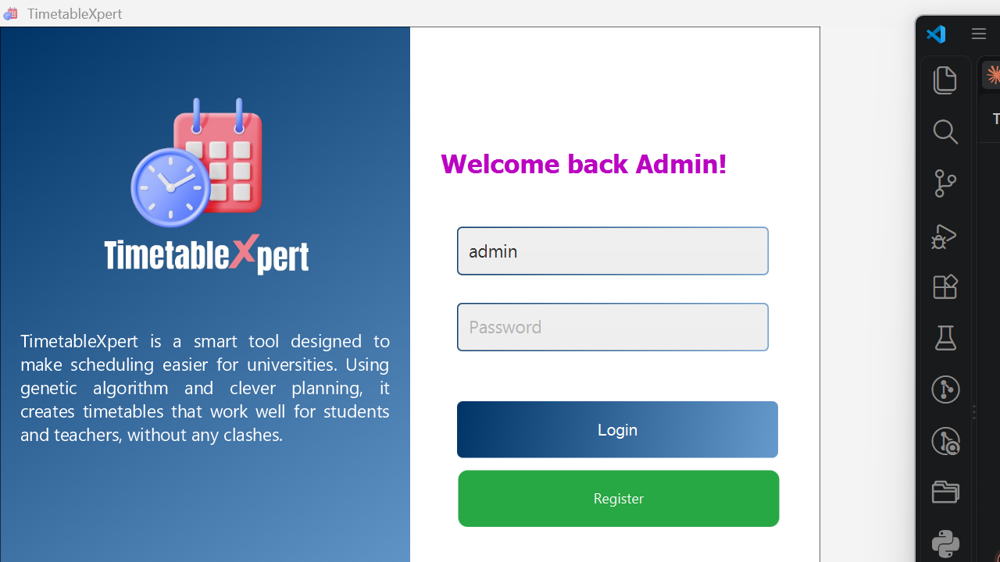 | 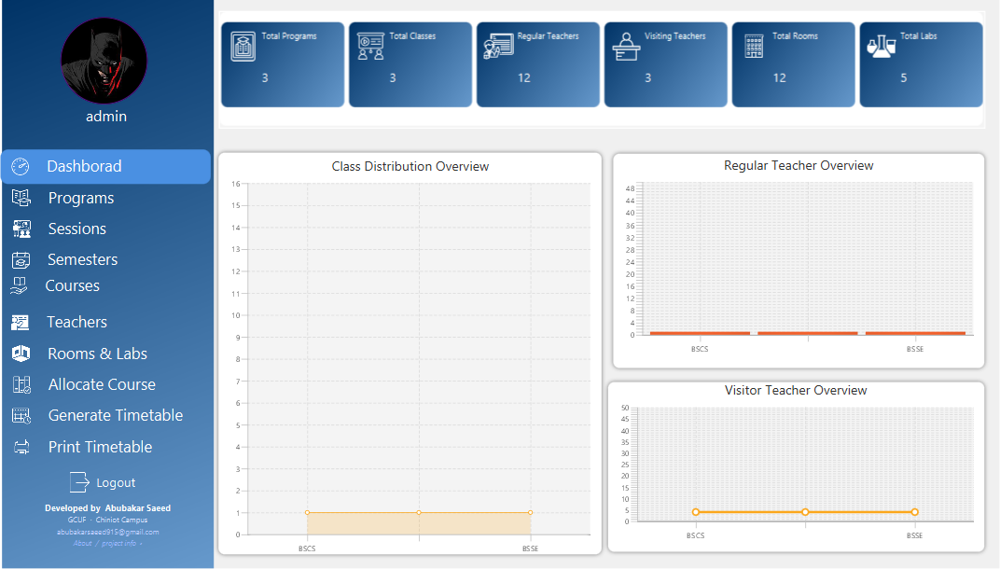 |
| **Login** &mdash; default `admin` / `admin` | **Dashboard (Step 0)** &mdash; live counts + progress rail |
| 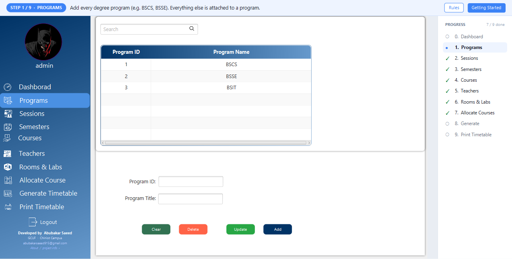 | 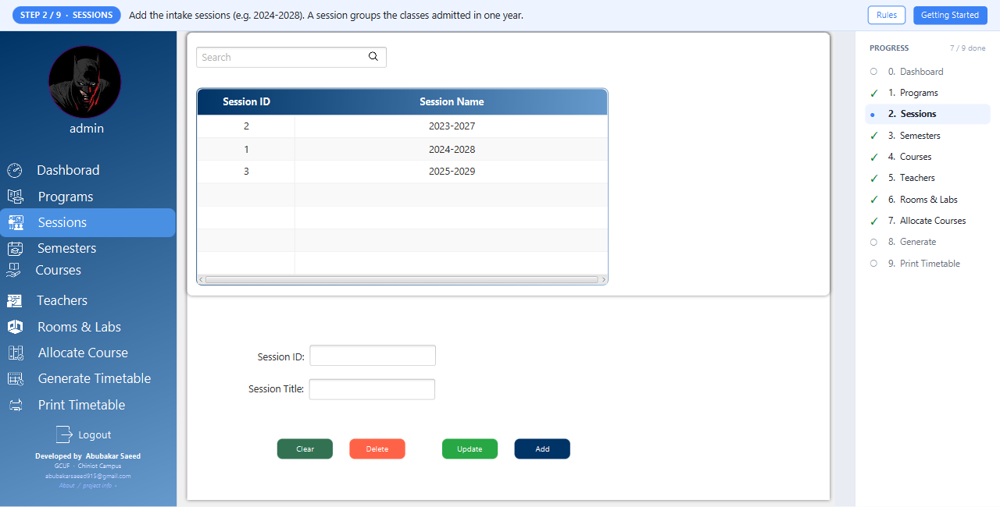 |
| **1. Programs** | **2. Sessions** |
| 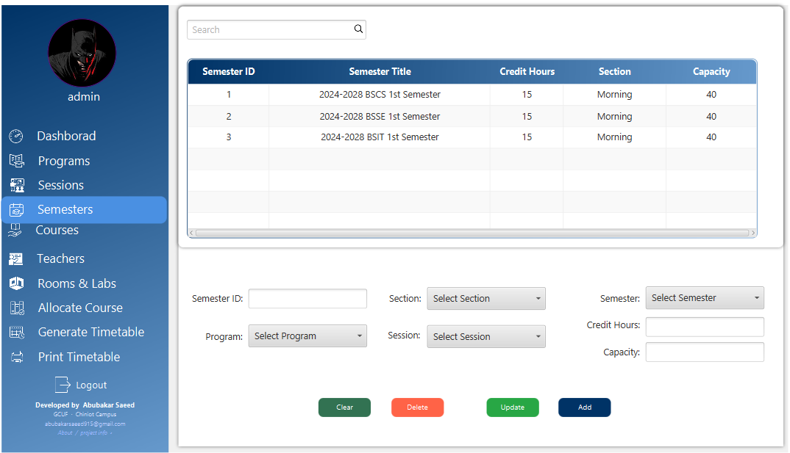 | 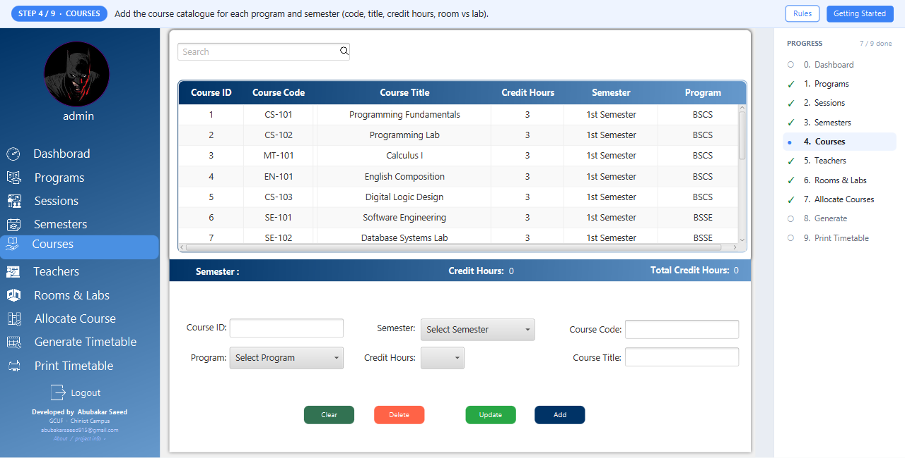 |
| **3. Semesters** | **4. Courses** |
| 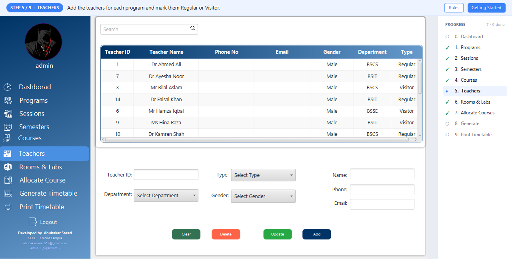 | 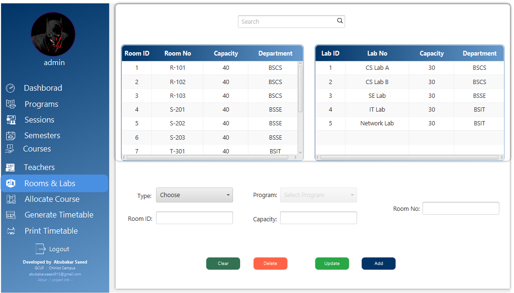 |
| **5. Teachers** | **6. Rooms &amp; Labs** |
| 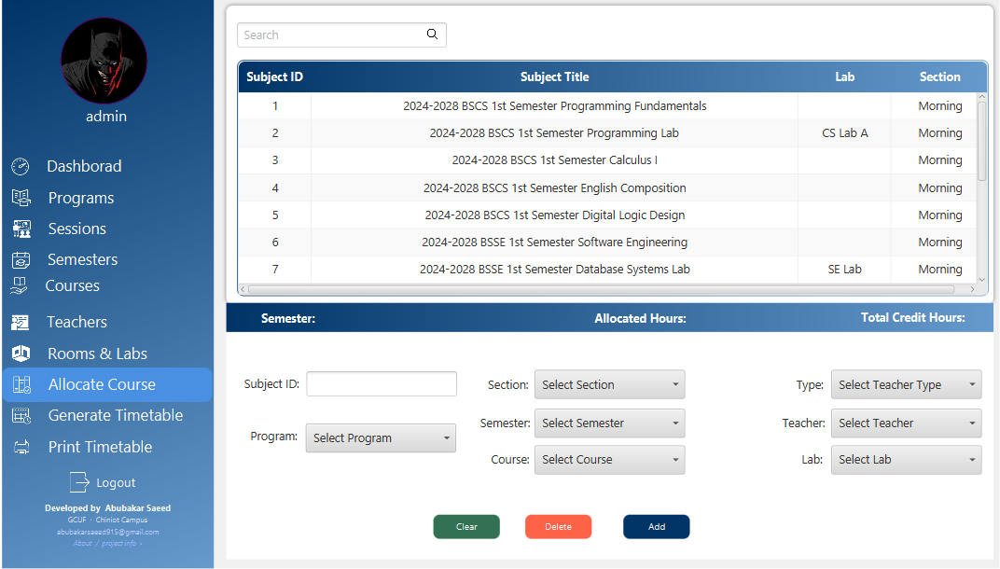 | 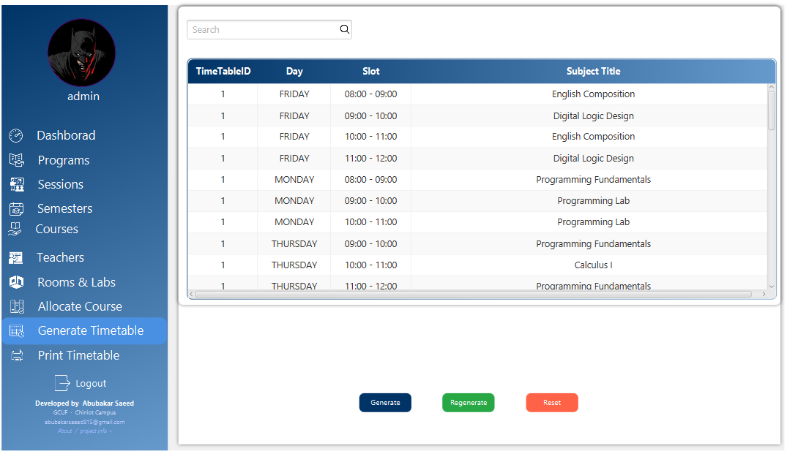 |
| **7. Allocate Courses** | **8. Generate** &mdash; produced timetable |
| 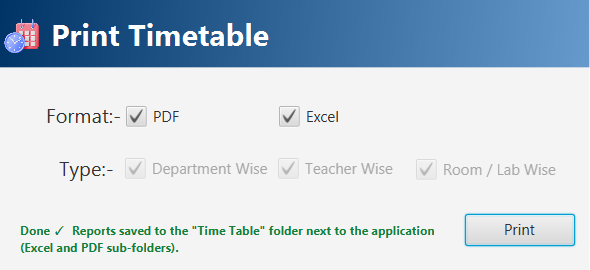 | 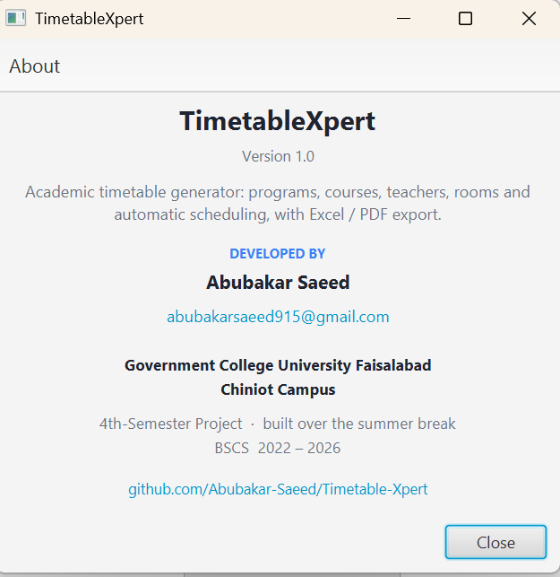 |
| **9. Print** &mdash; inline status, no pop-ups | **About** &mdash; developer / project info, clickable GitHub &amp; e-mail links |

### Generated reports

`Generate` produces a clash-free timetable; `Print` exports it four ways, as PDF
and Excel, into a `Time Table/` folder next to the app. Each is shown full size
below.

**Department wise** &mdash; full weekly grid for one class

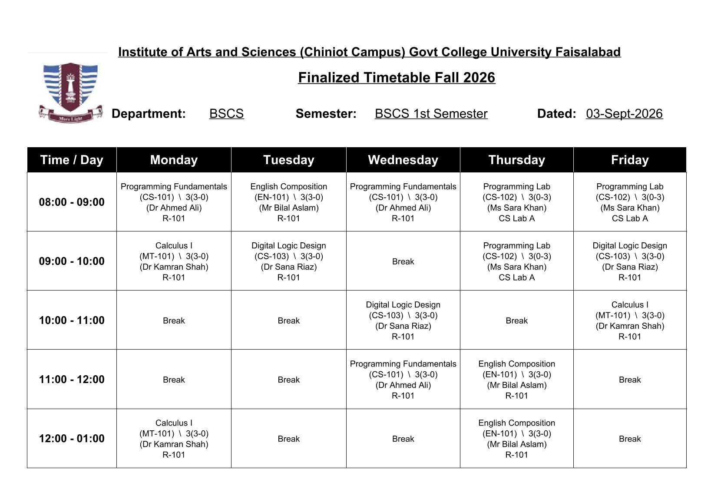

**Teacher wise** &mdash; one sheet per teacher

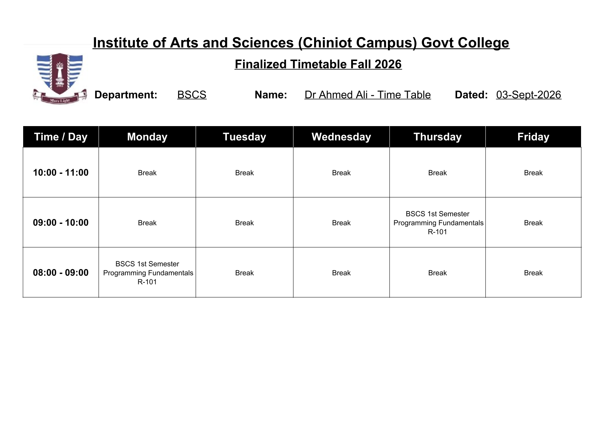

**Room wise** &mdash; one sheet per room

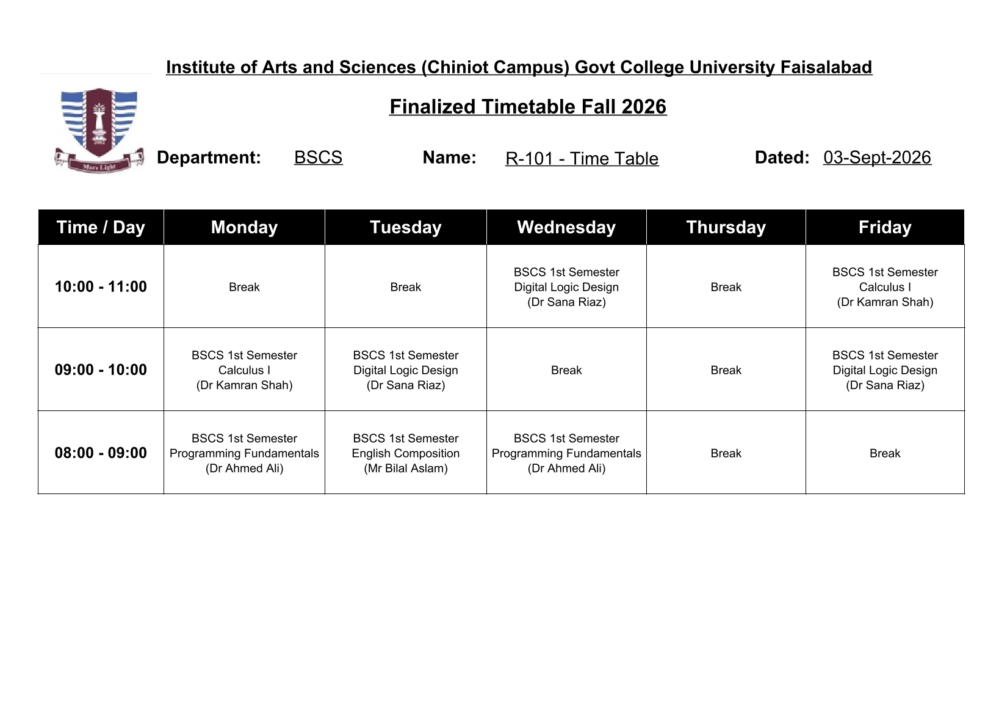

**Lab wise** &mdash; one sheet per lab

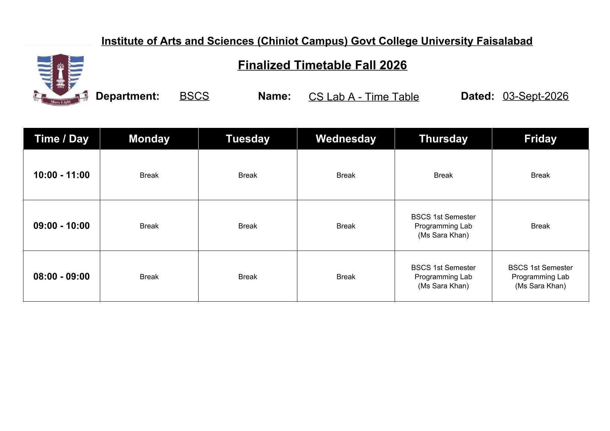

## Project layout

- `src/main/java/com/timetablexpert/` - application code
  - `MainApplication` / `GUIStarter` - entry point
  - `EmbeddedDatabase`, `PersistentDB` - bundled MariaDB lifecycle
  - `DataBaseLayer`, `DataAccessException` - JDBC helper
  - `SplashController`, `LoginController`, `RegisterController`, `HomeController`,
    `PrintController` - UI controllers
  - `Guidance`, `GuidanceUI`, `Stages`, `PasswordUtil` - guidance, window scaling,
    password hashing
  - `Program`, `Teacher`, `Room`, `Lab`, `Semester`, `Session`, `Course`,
    `AllocateCourse`, `GenerateTimeTable` - domain models
- `src/main/resources/com/timetablexpert/` - FXML views, CSS, images, `.jrxml`
  report templates
- `src/main/resources/db/schema.sql` - the self-contained schema the bundled
  engine imports
- `pom.xml` - Maven build (shade plugin produces `target/TimetableXpert.jar`)
- `build-portable.ps1` - one-command portable build
- `docs/KNOWN_ISSUES.md` - current limitations

## Technologies

Java 17 · JavaFX 23 · Maven · MariaDB4j (embedded MariaDB 11.4) ·
MariaDB JDBC driver · JasperReports · Apache POI · Apache PDFBox

## Notes

- The timetable-generation algorithm is a randomised greedy constructor
  implemented as a MySQL/MariaDB stored procedure. The Java side is a CRUD GUI
  over it. Verified on single-program, multi-program and evening/replica data:
  produces a valid timetable with no teacher/room/lab/semester clashes.
- See `docs/KNOWN_ISSUES.md` for remaining cosmetic items.
- Web version: https://github.com/Abubakar-Saeed/University-Timetable-Automation-GCUF
